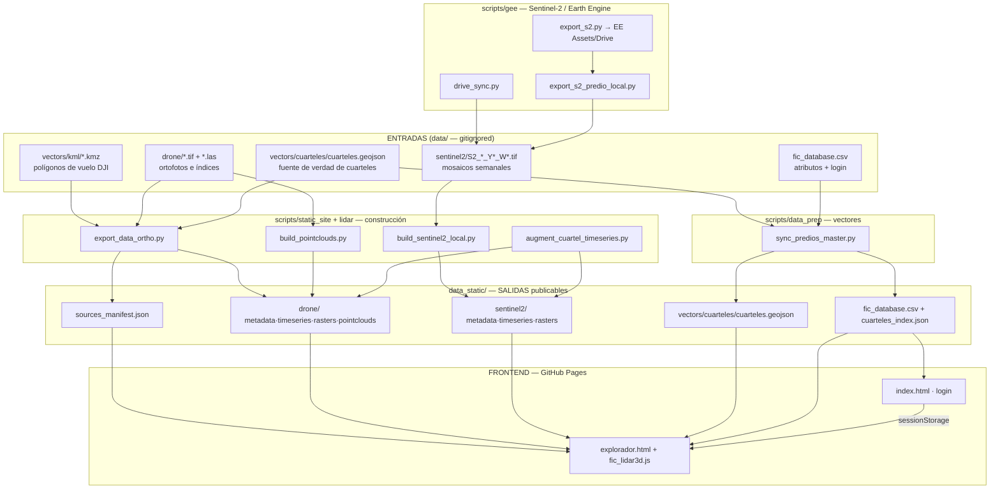

# FIC Agro — Arquitectura del proyecto

> Documentación completa del explorador web de monitoreo agrícola (dron
> multiespectral + Sentinel-2). Explica **qué hace cada archivo**, **cómo se
> conecta con el siguiente** y **cuáles son los flujos de actualización**.
>
> Última auditoría: julio 2026.

---

## 1. Visión general

FIC Agro es un **sitio estático** (pensado para GitHub Pages) que muestra en un
mapa los índices de vegetación de distintos predios agrícolas, a partir de dos
fuentes de datos:

- **Dron multiespectral** — ortofotos e índices (NDVI, NDWI, NDCI, RGB, térmica)
  de campañas de vuelo, más nubes de puntos LiDAR.
- **Sentinel-2** — series temporales satelitales semanales derivadas de Earth
  Engine (9 índices operativos).

La idea clave de la arquitectura es una **separación estricta en 3 capas**:

```
   ENTRADAS               PIPELINE (Python)              SALIDAS ESTÁTICAS        FRONTEND
   data/          ──►      scripts/*.py         ──►      data_static/       ──►   *.html + JS
   (crudo, local)         (transforma)                  (JSON/CSV/WebP)          (GitHub Pages)
   [gitignored]                                         [se publica]             [se publica]
```

- **`data/`** contiene los insumos crudos (GeoTIFF de dron/satélite, LAS, KML,
  shapefiles). Está **ignorado por git** (`.gitignore`) porque es pesado y vive
  solo en la máquina de trabajo.
- **`scripts/`** son las herramientas Python/PowerShell que convierten esos
  insumos en artefactos ligeros y optimizados para web.
- **`data_static/`** es lo único que el navegador consume: JSON de metadatos,
  series temporales, CSV de autenticación, WebP de rásters y GeoJSON de vectores.
- **`*.html` + `assets/`** son la aplicación: no tienen backend, solo hacen
  `fetch()` sobre `data_static/`.

**Regla de oro:** el frontend nunca lee `data/`; el pipeline nunca es necesario
en producción. Publicar = subir `data_static/` + los HTML + `assets/`.

---

## 2. Diagrama de flujo general



---

## 3. Estructura de carpetas

```text
fic_agro/
├── config.yaml              # Configuración central (predios, fuentes, índices)
├── requirements.txt         # Dependencias Python del pipeline
├── README.md                # Guía rápida de uso
├── index.html               # Página de login
├── explorador.html          # Aplicación de mapa (todo el frontend)
├── export_s2.js             # Script de referencia para el Code Editor de GEE
├── assets/
│   ├── img/                 # Logos, favicons, íconos de fuente (dron/satélite)
│   └── js/
│       └── fic_lidar3d.js   # Visor 3D de nubes de puntos (Three.js)
├── scripts/
│   ├── data_prep/           # Vectores: cuarteles, predios, sincronización
│   ├── gee/                 # Sentinel-2 desde Earth Engine
│   ├── static_site/         # Construcción de data_static (dron + S2)
│   └── lidar/               # Nubes de puntos LiDAR
├── data/                    # ENTRADAS crudas (gitignored)
│   ├── vectors/{kml,vuelos,cuarteles,comunas,export}/
│   ├── drone/               # *.tif e *.las por campaña
│   └── sentinel2/           # S2_{PREDIO}_Y{AAAA}_W{SS}.tif
├── data_static/             # SALIDAS publicables (ver §7)
└── documentación/           # Este documento
```

---

## 4. Frontend

### 4.1 `index.html` — puerta de acceso (login)

- **Qué hace:** autenticación 100% en el cliente. Descarga la lista de usuarios
  publicada y valida usuario/contraseña.
- **Entrada:** `fetch(data_static/fic_database.csv)`.
- **Lógica:** usuario = `propietario` (agricultor) o `asesor` normalizado;
  contraseña = apellido (última palabra del nombre). Define el nivel de acceso.
- **Salida:** guarda `sessionStorage['ficAuthSession']` con `{ rol, nivel,
  nombre }` y redirige a `explorador.html?nivel=…`.
- **Conecta con:** aguas abajo → `explorador.html` (requiere la sesión). Aguas
  arriba → `sync_predios_master.py` produce el CSV que aquí se lee.

### 4.2 `explorador.html` — aplicación de mapa

Es el corazón visible del proyecto: **todo el JS está inline** (~7.600 líneas).
No tiene backend; solo hace `fetch()` sobre `data_static/`.

- **Qué hace:** mapa Leaflet con vista partida (split) de Sentinel-2, capas de
  dron, gráficos de series temporales (Chart.js) y panel LiDAR 3D.
- **Constantes clave:**
  - `BASE = ficPageDirPrefix() + 'data_static'` — raíz de todas las lecturas.
  - `SOURCE_DATA_ROOT = … + 'data'` — fallback solo para desarrollo local.
- **Secuencia de arranque:**
  1. `loadManifest()` → `data_static/sources_manifest.json` (registro de fuentes).
  2. `ficEnsureGeoContextLoaded()` → por cada fuente, su `metadata.json` y
     `timeseries.json`.
  3. `loadFicDatabaseCsv()` → `fic_database.csv` (filtros por predio/cuartel).
  4. `loadPrediosAoiGeojson()` → `vectors/cuarteles/cuarteles.geojson` (polígonos
     y máscara de recorte).
  5. `FicLidar3d.bind(state, BASE)` → habilita el visor 3D.
- **Auth:** lee el mismo `sessionStorage`; si falta la sesión, redirige a
  `index.html`.
- **Librerías (CDN):** Chart.js 4.4.6, Leaflet 1.9.4, Three.js 0.128.0 +
  OrbitControls. Local: `assets/js/fic_lidar3d.js`.

### 4.3 `assets/js/fic_lidar3d.js` — visor LiDAR 3D

- **Qué hace:** renderiza nubes de puntos con Three.js dentro de `#las3dView`.
- **Entrada:** `state.metadata.drone.pointclouds[stem].p` → `fetch(BASE + '/' +
  ruta)` (JSON generado por `build_pointclouds.py`).
- **Conecta con:** aguas arriba → `build_pointclouds.py` (produce los JSON) y
  `export_data_ortho.py` (crea la estructura de metadatos donde se registran).

### 4.4 `assets/img/`

Logos y favicons (`Logo_FIC_Teleamb.png`, `favicon*.png`) e íconos de las
fuentes de datos (`dron.png`, `satelite.png`) usados en la UI.

### 4.5 `export_s2.js` (raíz)

- **Qué es:** script para el **Code Editor de Earth Engine**
  (https://code.earthengine.google.com/), **no** forma parte del sitio.
- **Uso:** alternativa manual/visual para generar los mosaicos semanales S2 en
  Assets. Es el equivalente en JavaScript de `scripts/gee/export_s2.py`.
- **Estado:** material de referencia. No lo ejecuta ningún pipeline.

---

## 5. Configuración — `config.yaml`

Archivo central que **todos los scripts** leen vía
`pipeline_utils.load_config()`. Secciones:

| Sección | Propósito | Campos relevantes |
|---------|-----------|-------------------|
| **Rutas** | Ubicación de vectores y salidas | `vectors_root`, `kml_root`, `cuarteles_path`, `predios_aoi_path`, banderas `predios_aoi_authoritative`, `cuarteles_geojson_authoritative` |
| **`year_start` / `year_end`** | Ventana temporal del pipeline S2 | `2018` … `auto` |
| **`predios:`** (16) | Registro canónico de predios | por cada uno: `name`, `aoi_filter_col` (`poligono_vuelo` o `id_cuartel`), `aoi_filter_val`, `drone_code`, `s2_code` |
| **`sources:`** | Las dos fuentes del mapa | `sentinel2` (9 índices GEE) y `drone` (`ndvi, ndwi, ndci, rgb, thermal`, `flat_date_filenames: true`) |
| **`raster_visualization:`** | Parámetros de export WebP | formato, factor de upscale, calidad, stretch RGB, recorte a AOI, caché de reuso |
| **`seasons:`** | Etiquetas de estaciones (ES) | verano/otoño/invierno/primavera |
| **`indices:`** | Metadatos UI **de índices dron** | `label`, `description`, `colormap`, `vmin`/`vmax`; `visual_only` para RGB/térmica |
| **`stats:`** | Reductor zonal | `["mean"]` |

> **Nota de coherencia:** los metadatos de visualización de los índices
> **Sentinel-2** (colormap/vmin/vmax) **no** están en `config.yaml`, sino en la
> tabla `BAND_VIZ` de `build_sentinel2_local.py`. Los de **dron** sí viven en
> `config.yaml → indices:`. Es el diseño actual; tenerlo presente al ajustar
> leyendas.

**Claves para alinear nombres** (crítico para que todo calce):

- `drone_code` → prefijo de los TIFF de dron: `{DRONE_CODE}_YYYYMMDD_{indice}.tif`.
- `s2_code` → prefijo de los TIFF S2: `S2_{S2_CODE}_Y{AAAA}_W{SS}.tif`.
- `aoi_filter_col` + `aoi_filter_val` → cómo se recorta el AOI del predio desde
  `cuarteles.geojson` (por polígono de vuelo o por lista de `id_cuartel`).

---

## 6. Pipelines (scripts/)

Cada script se clasifica como:

- **NÚCLEO** — imprescindible para actualizar el sitio de forma recurrente.
- **LIBRERÍA** — módulo compartido que otros importan (no se ejecuta solo).
- **SOPORTE** — se usa ocasionalmente (correcciones, análisis, casos puntuales).

### 6.1 Librerías compartidas (transversales)

| Archivo | Rol | Lo importan |
|---------|-----|-------------|
| `scripts/static_site/pipeline_utils.py` | **LIBRERÍA núcleo.** `load_config`, bootstrap de PROJ, carga de predios/cuarteles, `ensure_master_aoi`, `build_cuarteles_index`, resolución de códigos de dron y mapas de nombres S2. Puede escribir `data_static/predios_aoi.geojson`. | Casi todo `static_site/`, `export_s2_predio_local`, `build_pointclouds`, `sync_predios_master` |
| `scripts/gee/paths.py` | **LIBRERÍA.** Constantes EE: raíz del repo, `data/sentinel2`, carpeta de Drive, proyecto `teleambagr`, colección `S2_weekly_valpo`. | `export_s2_predio_local`, `drive_sync`, orquestadores PS1 |
| `scripts/data_prep/vectors_paths.py` | **LIBRERÍA.** Rutas de `data/vectors/*` y `data_static/vectors/cuarteles/*`. | Mayoría de `data_prep/` y `build_cuarteles_display_geojson` |
| `scripts/data_prep/cuartel_areas.py` | **LIBRERÍA.** `superficie_from_geometry()` — hectáreas desde WGS84 vía UTM 19S. | `build_predios_geojson`, `shp_to_cuarteles`, `sync_predios_master`, `audit_cuarteles` |

### 6.2 `scripts/data_prep/` — vectores, cuarteles y autenticación

Prepara la geometría de los cuarteles/predios y la tabla de usuarios.

| Archivo | Clase | Qué hace | Entra → Sale |
|---------|-------|----------|--------------|
| `sync_predios_master.py` | **NÚCLEO** | Sincronización maestra: toma `cuarteles.geojson`, aplica AOI si corresponde, y despliega todo a `data_static`. | `cuarteles.geojson` + `config.yaml` → `data_static/vectors/cuarteles/cuarteles.geojson`, `data/fic_database.csv`, `data_static/fic_database.csv`, `data_static/cuarteles_index.json` |
| `apply_predios_aoi_to_cuarteles.py` | **NÚCLEO (condicional)** | Propaga geometrías de `predios_aoi.geojson` a los cuarteles cuando `cuarteles_geojson_authoritative: false`. Lo llama solo `sync_predios_master`. | `predios_aoi.geojson` → cuarteles |
| `build_predios_geojson.py` | SOPORTE | Reconstruye `cuarteles.geojson` desde geojson previo + CSV + KMZ. | KMZ/CSV → `data/vectors/cuarteles/cuarteles.geojson` |
| `build_vuelos_geojson.py` | SOPORTE | Compila los KMZ de `kml/` en un `vuelos.geojson`. | `kml/*.kmz` → `data/vectors/vuelos/vuelos.geojson` |
| `shp_to_cuarteles_geojson.py` | SOPORTE | Convierte `cuarteles.shp` → `cuarteles.geojson`. Con `--sync` llama a `sync_predios_master`. | `.shp` → `.geojson` |
| `assign_comunas_from_shape.py` | SOPORTE | Cruce espacial cuarteles × `comunas.shp` para asignar comuna/provincia. Con `--sync` sincroniza. | `comunas.shp` → cuarteles |
| `convert_kmz_to_shapefile_utm19s.py` | SOPORTE | KMZ → shapefile en UTM 19S (vía `ogr2ogr`). | `.kmz` → `.shp` |
| `scan_drone_predio_codes.py` | SOPORTE | Escanea `data/drone/` buscando códigos antiguos. | diagnóstico |
| `audit_cuarteles.py` | SOPORTE | QA de solo lectura: contrasta geojson vs CSV vs config. | reporte |

### 6.3 `scripts/gee/` — Sentinel-2 desde Earth Engine

Genera y mantiene la ImageCollection semanal S2 (EPSG:4326, 10 m) y la baja
local por predio. Índices: `NDVI, NDMI, MNDWI, REDEDGE_POSITION, MCARI, GNDVI,
MSAVI, EVI, PSRI` + `clear_pixel_count`. Cuantización Int16 (×1000, salvo
`REDEDGE_POSITION` ×10).

| Archivo | Clase | Qué hace | Entra → Sale |
|---------|-------|----------|--------------|
| `export_s2.py` | **NÚCLEO** | Genera mosaicos semanales ISO (mediana) → ImageCollection en EE Assets; export opcional a Drive por predio. Flags: `--empty-collection`, `--force`, `--start-year`, `--delete-year`. | EE + AOI → EE Assets / Drive TIF |
| `export_s2_predio_local.py` | **NÚCLEO** | Baja recortes semanales por predio desde la IC. Con `--year` filtra por año ISO. | EE IC → `data/sentinel2/S2_*.tif` |
| `drive_sync.py` | **NÚCLEO** | Mirror incremental Drive → local usando credenciales EE. Estado en `drive_sync_keys_state.json`. | Drive → `data/sentinel2/` |
| `copy_drive_sentinel2_local.py` | **NÚCLEO (CLI fino)** | Envoltorio de línea de comandos sobre `drive_sync.main`. | — |
| `stats_s2_shapes.py` | SOPORTE | Estadística zonal (media espacial) por predio → CSV/PNG. Análisis paralelo, no alimenta al explorador. | EE → CSV |
| `paths.py` | LIBRERÍA | (ver §6.1) | — |

**Orquestadores PowerShell:**

| Script | Cadena que ejecuta |
|--------|--------------------|
| `run_s2_fill_and_build.ps1` | `export_s2_predio_local.py --reference E_SAZO` → `build_sentinel2_local.py` |
| `wait_ic_and_build.ps1` | Espera tareas de la IC → rellena semanas → build estático |
| `wait_2026_and_download.ps1` | Igual + `--year 2026 --force` (específico de una campaña) |

### 6.4 `scripts/static_site/` — construcción de `data_static/`

Convierte los TIFF de dron y S2 en WebP + JSON que el frontend consume.

| Archivo | Clase | Qué hace | Entra → Sale |
|---------|-------|----------|--------------|
| `export_data_ortho.py` | **NÚCLEO** | Exportador principal de dron: GeoTIFF → WebP + metadatos + series. Al terminar el bloque dron, lanza `build_cuarteles_display_geojson`. | `data/drone/*.tif` + cuarteles → `data_static/drone/{metadata,timeseries}.json`, `rasters/*.webp`, `csv/*`, `predios_aoi.geojson`, `sources_manifest.json` |
| `build_sentinel2_local.py` | **NÚCLEO** | Agrega los TIFF S2 en WebP + metadata/timeseries/CSV. Contiene `BAND_VIZ` (colormaps y rangos S2), interpolación bilineal de los índices y percentiles robustos p2/p98. | `data/sentinel2/*.tif` → `data_static/sentinel2/*`; actualiza `sources_manifest.json` |
| `pipeline_utils.py` | LIBRERÍA | (ver §6.1) | — |
| `augment_cuartel_timeseries.py` | SOPORTE | Añade bloques por `id_cuartel` a los `timeseries.json` (dron y S2) y refresca `cuarteles_index.json`. Se corre **después** del build. | timeseries → timeseries enriquecido |
| `build_cuarteles_display_geojson.py` | SOPORTE | Genera `cuarteles_display.geojson` (contornos alineados a píxel) y copia `fic_database.csv` a estático. Lo llama `export_data_ortho`. | cuarteles → `cuarteles_display.geojson` |
| `export_single_drone_raster.py` | SOPORTE | Incremental: un TIFF nuevo → WebP + parche a `metadata.json`. Reutiliza helpers de `export_data_ortho`. | 1 `.tif` → 1 `.webp` |
| `build_drone_raster_cuartel_outlines.py` | SOPORTE | Intersección huella α × cuartel → `drone/outlines/*.geojson`. Solo por CLI manual. | rásters → outlines |
| `remap_s2_webp_colormap.py` | SOPORTE | Re-colorea WebP S2 existentes cuando cambia un colormap, **sin** re-procesar el GeoTIFF (vectorizado con NumPy). | `.webp` → `.webp` |

### 6.5 `scripts/lidar/`

| Archivo | Clase | Qué hace | Entra → Sale |
|---------|-------|----------|--------------|
| `build_pointclouds.py` | **NÚCLEO (cuando hay LAS)** | Submuestrea `data/drone/*.las` → JSON y parcha `drone/metadata.json` (`pointclouds`, `lidar_attributes`, `lidar_stretch`). Requiere que `export_data_ortho` ya haya creado el metadata. | `*.las` → `data_static/drone/pointclouds/{predio}_{AAAAMMDD}.json` |

---

## 7. Salidas — `data_static/`

Es lo único que se publica y lo único que el navegador lee.

```text
data_static/
├── sources_manifest.json          # ★ Punto de entrada del explorador
├── fic_database.csv               # ★ Login (index.html) + atributos (explorador)
├── cuarteles_index.json           # ★ id_cuartel → metadatos del predio
├── predios_aoi.geojson            # AOI por predio (lo usa el pipeline; no lo lee el mapa)
├── vectors/cuarteles/
│   ├── cuarteles.geojson          # ★ Vectores desplegados (los lee el mapa)
│   └── cuarteles_display.geojson  # Contornos alineados a píxel (no lo lee el mapa)
├── drone/
│   ├── metadata.json              # ★ Índice de rásters, leyendas, periodos, pointclouds
│   ├── timeseries.json            # ★ Series para gráficos (predio + cuartel)
│   ├── rasters/*.webp             # ★ Capas de imagen del mapa
│   ├── pointclouds/*.json         # ★ Nubes LiDAR (las lee fic_lidar3d.js)
│   ├── outlines/*.geojson         # Contornos por ráster (referidos en metadata; el mapa no los pide)
│   └── csv/*_timeseries.csv       # Export/análisis (los gráficos usan el JSON)
└── sentinel2/
    ├── metadata.json              # ★ Rásters S2, modos de vista, escalas de color
    ├── timeseries.json            # ★ Series S2
    ├── rasters/*.webp             # ★ Capas del split-map
    └── csv/*_timeseries.csv       # Export/análisis
```

★ = leído directamente por el frontend (verificado por `fetch` en el HTML).

**Artefactos que el frontend NO pide directamente** (los produce el pipeline y/o
se referencian dentro de otro JSON, pero no hay `fetch` a ellos): `predios_aoi.geojson`,
`cuarteles_display.geojson`, `drone/outlines/*`, todos los `csv/*`. Se conservan
porque son insumos del propio pipeline o material de exportación/análisis.

---

## 8. Flujos de actualización (recetas)

### 8.1 Editaste cuarteles / atributos / usuarios

```powershell
# cualquiera de estas rutas termina sincronizando data_static + CSV + índice
python scripts/data_prep/shp_to_cuarteles_geojson.py --sync   # si vienes de un .shp
python scripts/data_prep/assign_comunas_from_shape.py --sync  # si reasignas comunas
python scripts/data_prep/sync_predios_master.py               # sincronización directa
```

### 8.2 Nueva campaña de dron

```powershell
python scripts/static_site/export_data_ortho.py               # TIFF → WebP + metadata
python scripts/lidar/build_pointclouds.py                     # (si hay .las nuevos)
python scripts/static_site/augment_cuartel_timeseries.py      # gráficos por cuartel
```

Para **un solo ráster nuevo** (más rápido):

```powershell
python scripts/static_site/export_single_drone_raster.py <ruta_al_tif>
```

### 8.3 Actualizar Sentinel-2

```powershell
# Mantenimiento incremental (semanas nuevas):
scripts/gee/run_s2_fill_and_build.ps1

# o manual, paso a paso:
python scripts/gee/export_s2_predio_local.py --reference E_SAZO --all-predios
python scripts/static_site/build_sentinel2_local.py
```

Re-exportación completa o borrar un año → ver `scripts/gee/README.md`.

### 8.4 Publicar

```powershell
git add data_static explorador.html index.html assets config.yaml
git commit -m "actualiza datos estáticos"
git push          # GitHub Pages sirve el sitio
```

Para revisar localmente (evita `file://` por CORS):

```powershell
python -m http.server 8090   # abre http://localhost:8090/index.html
```

---

## 9. Cómo añadir un predio nuevo (checklist)

Este es el procedimiento genérico (reemplaza los scripts puntuales que existían
para casos concretos como Salazar):

1. **Geometría:** coloca el KMZ/shapefile en `data/vectors/kml/` y agrégalo a
   `cuarteles.geojson` (vía `build_predios_geojson.py` o edición directa),
   asignando `id_cuartel` únicos.
2. **`config.yaml → predios:`** añade la entrada con `name`, `aoi_filter_col`,
   `aoi_filter_val`, `drone_code` y `s2_code`.
3. **Atributos/login:** corre `sync_predios_master.py` para regenerar
   `fic_database.csv`, `cuarteles_index.json` y desplegar los vectores.
4. **Dron:** deja los TIFF como `{DRONE_CODE}_YYYYMMDD_{indice}.tif` en
   `data/drone/` y corre `export_data_ortho.py`.
5. **LiDAR (opcional):** deja el `.las` en `data/drone/` y corre
   `build_pointclouds.py`.
6. **Series por cuartel:** corre `augment_cuartel_timeseries.py`.
7. **Sentinel-2 (opcional):** baja los TIFF con `export_s2_predio_local.py` y
   corre `build_sentinel2_local.py`.
8. **Verifica** en el explorador y publica.

---

## 10. Convenciones de nombres

| Elemento | Patrón | Ejemplo |
|----------|--------|---------|
| TIFF dron | `{DRONE_CODE}_YYYYMMDD_{indice}.tif` | `L_MARTINEZ_20260612_ndvi.tif` |
| WebP dron | `{DRONE_CODE}_YYYY_MM_DD_{indice}.webp` | `R_SALAZAR_2026_06_26_ndvi.webp` |
| TIFF S2 | `S2_{S2_CODE}_Y{AAAA}_W{SS}.tif` | `S2_E_SAZO_Y2026_W12.tif` |
| WebP S2 | `S2_{predio}_{compuesto}_{banda}.webp` | — |
| Outlines | `{predio}_{YYYYMMDD}_{indice}.geojson` | `e_sazo_20260612_ndvi.geojson` |
| Pointcloud | `{predio_id}_{YYYYMMDD}.json` | `r_salazar_20260626.json` |
| Cuartel | `id_cuartel` = `cNNNNN` | `c00031` |

---

## 11. Dependencias — `requirements.txt`

- **Earth Engine + Drive:** `earthengine-api`, `google-api-python-client`,
  `google-auth*`.
- **Geoespacial:** `geopandas`, `rasterio`, `shapely`, `pyproj`.
- **Rásters/imágenes:** `numpy`, `Pillow`, `matplotlib`.
- **Datos:** `pandas`, `PyYAML`.
- **LiDAR:** `laspy`.

Instalación:

```powershell
python -m venv .venv
.\.venv\Scripts\Activate.ps1
pip install -r requirements.txt
```

---

## 12. Limpieza aplicada en esta auditoría

Se eliminaron archivos que no participan en el sitio ni en su actualización:

- **~24 scripts `scripts/debug_*.py`** — herramientas Playwright de depuración
  puntual, sin importadores ni referencias.
- **`logs/`** completo y logs sueltos (`debug-be0375.log`,
  `export_drone_log.txt`) — salidas de ejecución, ya ignoradas por `.gitignore`.
- **`_tmp_check.js`, `debug-bisect-sat.json`** — artefactos temporales.
- **Scripts de un solo uso** ya ejecutados: `make_salazar_kmz.py`,
  `update_salazar_cuarteles.py`, `migrate_static_predio_keys.py` (su
  procedimiento genérico quedó documentado en §9).
- **`data_static/fic_database.json`** — JSON heredado sin lector ni escritor
  (el sitio usa el CSV).

Todo lo eliminado es recuperable vía git salvo lo que ya estaba fuera de control
de versiones (debug/logs/temp).

> Sugerencia: varios scripts útiles de `scripts/data_prep/` y los orquestadores
> `wait_*.ps1` siguen **sin commitear**. Conviene versionarlos para no perderlos.
